# AI Tool Finder

🔍 A modern web application that helps users discover the most relevant AI tools based on their specific needs. The application leverages the [Firecrawl API](https://www.firecrawl.dev/) to search through over 200 AI directories, providing accurate and comprehensive results.

<p align="center">
  
</p>

## 🎬 Demo Video

Check out the demo video to see the AI Tool Finder in action:

[](https://www.youtube.com/watch?v=Tn5O0LgwysA)

## ✨ Features

- **Clean Modern UI**: Black translucent blurry design with beautiful animations
- **Split Layout**: Tool information on the left (3/4) and chat interface on the right (1/4)
- **Tabbed Interface**: Easily navigate between Features, Use Cases, Pricing, Reviews, and more
- **Media Section**: View demo videos and screenshots with an image carousel
- **Dynamic Search**: Rotating placeholder suggestions and clickable topic buttons
- **Responsive Design**: Fully optimized for all screen sizes
- **Comprehensive Results**: Get detailed information about each AI tool including pricing, reviews, and use cases

## 🛠️ Tech Stack

- **Frontend**: React, TypeScript
- **Styling**: Tailwind CSS
- **Animations**: Framer Motion
- **API Integration**: Firecrawl API
- **State Management**: React Context API
- **Authentication**: Firebase Auth

## 🔍 How It Works

```mermaid
%%{init: {'theme': 'base', 'themeVariables': { 'fontSize': '16px', 'fontFamily': 'Arial', 'primaryColor': '#3498db', 'primaryTextColor': '#fff', 'primaryBorderColor': '#2374ab', 'lineColor': '#000000', 'textColor': '#000000', 'fontSize': '20px' }}}%%

flowchart TD
    %% Main Nodes
    User((👤 USER)):::user
    Search[/🔍 SEARCH QUERY\]:::input
    Frontend[📱 AI TOOL FINDER]:::processing
    API[🔥 FIRECRAWL API]:::processing
    Extract[🔄 CONTENT EXTRACTION]:::data
    Directory1[📂 AI DIRECTORY 1]:::source
    Directory2[📂 AI DIRECTORY 2]:::source
    DirectoryN[📂 AI DIRECTORY N]:::source
    Processor[⚙️ DATA PROCESSOR]:::processing
    DB[(💾 TOOL DATABASE)]:::data
    Results[📊 RESULTS DISPLAY]:::output
    Filter[🔍 FILTER & SORT]:::input
    Details[📋 DETAILED TOOL VIEW]:::output
    
    %% Connections with clear text
    User -->|"TYPES QUERY"| Search
    Search -->|"SUBMITS"| Frontend
    Frontend -->|"REQUESTS DATA"| API
    API -->|"SCRAPES"| Directory1
    API -->|"SCRAPES"| Directory2
    API -->|"SCRAPES"| DirectoryN
    Directory1 -->|"RAW HTML"| Extract
    Directory2 -->|"RAW HTML"| Extract
    DirectoryN -->|"RAW HTML"| Extract
    Extract -->|"STRUCTURED DATA"| Processor
    Processor -->|"INDEXED TOOLS"| DB
    DB -->|"RELEVANT TOOLS"| Results
    Results -->|"DISPLAYS TO"| User
    User -->|"APPLIES FILTERS"| Filter
    Filter -->|"UPDATES"| Results
    User -->|"SELECTS TOOL"| Details
    Details -->|"SHOWS"| User
    
    %% Styling with high contrast
    classDef user fill:#9b59b6,stroke:#000,stroke-width:3px,color:#fff,font-weight:bold
    classDef input fill:#3498db,stroke:#000,stroke-width:2px,color:#fff,font-weight:bold
    classDef processing fill:#e74c3c,stroke:#000,stroke-width:2px,color:#fff,font-weight:bold
    classDef source fill:#2ecc71,stroke:#000,stroke-width:2px,color:#000,font-weight:bold
    classDef data fill:#f39c12,stroke:#000,stroke-width:2px,color:#000,font-weight:bold
    classDef output fill:#1abc9c,stroke:#000,stroke-width:2px,color:#000,font-weight:bold
```



## 💡 Expanding Tool Sources & Functionality

This application is designed to be extensible, allowing you to integrate various sources for discovering AI tools and enhance its capabilities. The primary tool finding logic is within `src/services/tool-finder.ts`.

### Using a Comprehensive List of AI Directories

For a more comprehensive tool discovery process, you can leverage curated lists of AI directories. A great resource for this is:

*   **[AI Directories List on GitHub by harshith-eth](https://github.com/harshith-eth/ai-directories)**

To integrate this (or similar lists):

1.  **Configure a New Source**:
    *   Add a new configuration object to the `TOOL_SOURCES` array in `src/services/tool-finder.ts`.
    *   You'll likely want to fetch the raw content of the directory list (e.g., the README.md from the GitHub repository). You might need to add a small utility function in `src/services/firecrawl.ts` (using `scrapeSingleUrl` with a `markdown` format) or use a simple `fetch` if it's a raw text/markdown file accessible via URL.
    *   Implement a `toolUrlExtractor` function within your new source configuration. This function will parse the fetched content (e.g., markdown table) to extract individual tool names and their direct website URLs.

2.  **Process Extracted URLs**:
    *   The `tool-finder.ts` service can then take these URLs and use the `extractToolInfoWithAgent` function (from `src/services/firecrawl.ts`) to perform a deep scrape and analysis of each tool's website using the FIRE-1 agent.

This approach allows the application to dynamically pull from and process a wide range of AI tool sources.

### Customizing AI Behavior

The AI's responses and data extraction capabilities can be fine-tuned by modifying the prompts within:

*   `src/services/azure-openai.ts`: Contains prompts for various tasks like tool data extraction, ranking, and enhancement.
*   `src/services/chat-service.ts`: Manages the prompts for the contextual AI chat assistant.

Adjusting these prompts can significantly alter the performance and output quality of the AI components.

## 🚀 Getting Started

### Prerequisites

- Node.js (v16 or higher)
- npm or yarn
- Firecrawl API key (get one [here](https://www.firecrawl.dev/))
- Azure API key for AI assistant functionality

### Installation

1. Clone the repository
   ```bash
   git clone https://github.com/firecrawl-dev/ai-tool-finder.git
   cd ai-tool-finder
   ```

2. Install dependencies
   ```bash
   npm install
   # or
   yarn
   ```

3. Create a `.env` file in the root directory and add your API keys:
   ```
   VITE_FIRECRAWL_API_KEY=your_firecrawl_api_key_here
   VITE_AZURE_API_KEY=your_azure_api_key_here
   VITE_AZURE_ENDPOINT=your_azure_endpoint_here
   ```

4. Start the development server
   ```bash
   npm run dev
   # or
   yarn dev
   ```

5. Build for production
   ```bash
   npm run build
   # or
   yarn build
   ```

## 📂 Project Structure

```
ai-tool-finder/
├── public/             # Static assets
├── src/
│   ├── components/     # React components
│   ├── contexts/       # React contexts
│   ├── hooks/          # Custom hooks
│   ├── services/       # API services
│   ├── styles/         # Global styles
│   ├── types/          # TypeScript type definitions
│   ├── utils/          # Utility functions
│   ├── App.tsx         # Main application component
│   ├── background.tsx  # Animated particle background
│   └── main.tsx        # Application entry point
├── .env                # Environment variables
├── package.json        # Project dependencies
└── README.md           # This documentation
```

## 🤝 Contributing

We welcome contributions from the community! To contribute:

1. Fork the repository
2. Create a new branch (`git checkout -b feature/amazing-feature`)
3. Make your changes
4. Commit your changes (`git commit -m 'Add some amazing feature'`)
5. Push to the branch (`git push origin feature/amazing-feature`)
6. Open a Pull Request

For major changes, please open an issue first to discuss what you would like to change.

## 📜 License

This project is licensed under the MIT License - see the [LICENSE](LICENSE) file for details.

---

<p align="center">
  <a href="https://www.firecrawl.dev/sign" target="_blank">
    
  </a>
</p>

<p align="center">
  Built with ❤️ for the open source community
</p>

<p align="center">
  Powered by
  <br>
  <a href="https://www.firecrawl.dev/" target="_blank">
    🔥 Firecrawl
  </a>
</p>

---

## 📞 Contact

For any queries, reach out to Firecrawl.

Follow us on Twitter: [@firecrawl_dev](https://x.com/firecrawl_dev)

We are publishing more such tools! Stay tuned and feel free to contribute to this project.